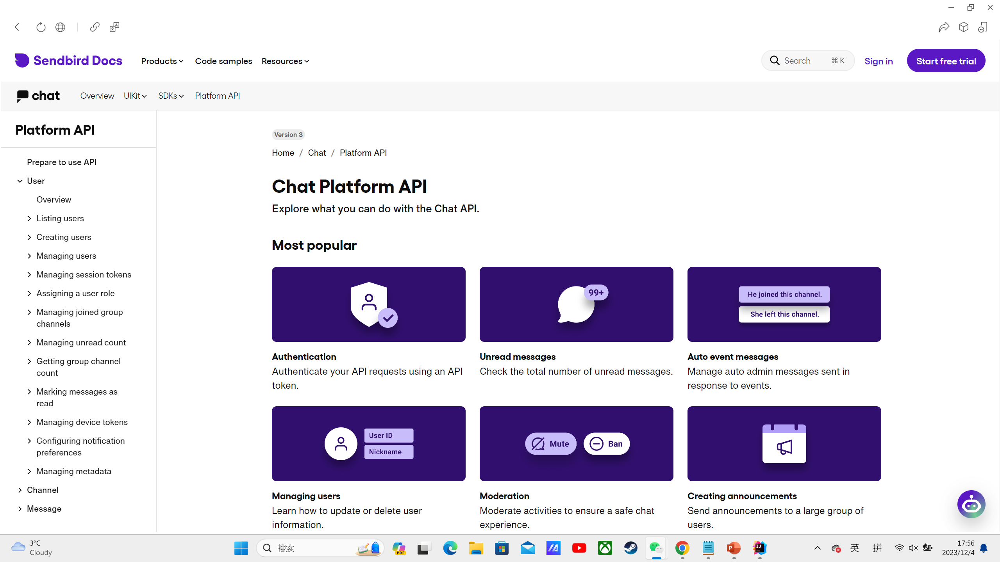

# Group264Project — YouChat

1. Description: Our project "YouChat" is a chatting app, which includes the functions of:

   - Sending and receiving messages.
   - Replying messages.
   - Translating messages.
   - Searching for chat histories.
   - Create group chats.
   - Invite members to group chat.

   We have created these entities:
   - User entity,
   - Message entity,
   - Channel entity,

2. Brief explanation:
   For User entity, we called CreateUserUseCase which can call a POST method to send request to create a User in application. 
   To create a user, people need to enter their user_id and nickname, there will be some pop-up windows to remind them 
   if the user_id is already exist while signing up or the user_id and nickname is not matching while logging in. 
   After logging in successfully there will be a menu that shows a few functionalities, which includes viewing their 
   personal profile that shows their user_if and nickname.

   For Channel entity, we also called CreateChannelUseCase which can call a POST method to send request to create a 
   channel in our application and invite members to join the group chat. The menu after logging in also allows people to 
   create channels and invite members with their user_id, and all the channels created will be shown on the menu.

   While sending messages, there are three buttons in the chatting view that allow users to translate  messages into 
   Chinese, English and French. YouChat is also able to keep track to chatting histories, and people can search for the 
   specific messages they want. And people can search for chatting histories by keywords or date.

3. About our API:
   We have used two APIs which are sendbirdapi and yandexapi.
   - 
   - 
     User:
   - Base URL: "https://api-39ACFA95-6D71-49B3-B9EF-EDDA2080C415.sendbird.com/v3"
   - CreateUserUseCase URL: BASE_URL + "/users"
     Channel:
   - Base URL: "https://api-39ACFA95-6D71-49B3-B9EF-EDDA2080C415.sendbird.com/v3"
   - CreateChannel: BASE_URL + "/group_channels"
     Message:
   - Base URL: "https://api-39ACFA95-6D71-49B3-B9EF-EDDA2080C415.sendbird.com/v3"
   - CreateMessage: BASE_URL + "/" + channelType + "/" + channelUrl + "/messages"
